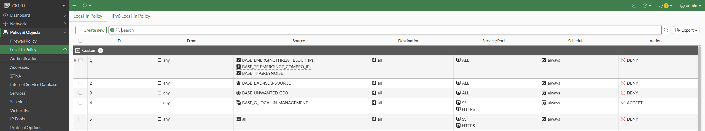

# Finished local-in policy structure

This is an example of a local-in policy configuration that includes:

* Threat feeds
* ISDB objects
* Restriction of management access

**Note:** This is purely for illustration purposes. You cannot copy this configuration. The necessary objects are not created in this example. Refer to the [**baseline.md**](../../baseline.md) for this.

## GUI structure



## CLI configuration
```
config firewall local-in-policy
    edit 1
        set intf "any"
        set srcaddr "BASE_EMERGINGTHREAT_BLOCK_IPs" "BASE_TF-EMERGINGT_COMPRO_IPs" "BASE_TF-GREYNOISE"
        set dstaddr "all"
        set service "ALL"
        set schedule "always"
        set comments "BLOCK BAD THREAT FEEDS TO FORTIGATE. FORTIGATE BASELINE FROM https://guenay.at"
    next
    edit 2
        set intf "any"
        set dstaddr "all"
        set internet-service-src enable
        set internet-service-src-group "BASE_BAD-ISDB-SOURCE"
        set service "ALL"
        set schedule "always"
        set comments "BLOCK ISDB SOURCES TO FORTIGATE. FORTIGATE BASELINE FROM https://guenay.at"
    next
    edit 3
        set intf "any"
        set srcaddr "BASE_UNWANTED-GEO"
        set dstaddr "all"
        set service "ALL"
        set schedule "always"
        set comments "BLOCK UNWANTED GEO TO FORTIGATE. FORTIGATE BASELINE FROM https://guenay.at"
    next
    edit 4
        set intf "any"
        set srcaddr "BASE_G_LOCAL-IN-MANAGEMENT"
        set dstaddr "all"
        set action accept
        set service "SSH" "HTTPS"
        set schedule "always"
        set virtual-patch enable
        set comments "ALLOW PRIVILEGED NETWORKS TO ACCESS MANAGEMENT SERVICES. FORTIGATE BASELINE FROM https://guenay.at"
    next
    edit 5
        set intf "any"
        set srcaddr "all"
        set dstaddr "all"
        set service "SSH" "HTTPS"
        set schedule "always"
        set comments "DENY ACCESS TO MANAGEMENT SERVICES. FORTIGATE BASELINE FROM https://guenay.at"
    next
end
```